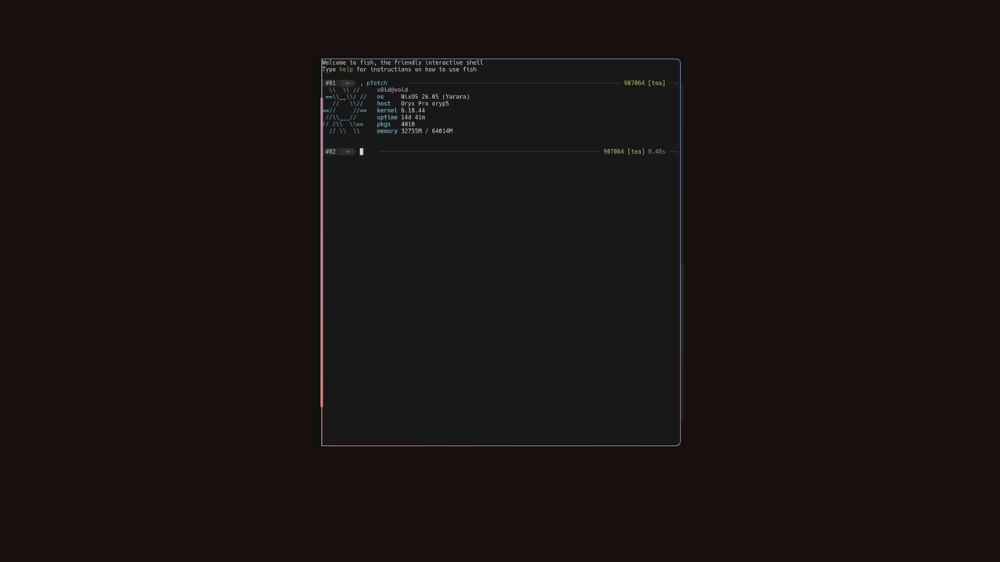
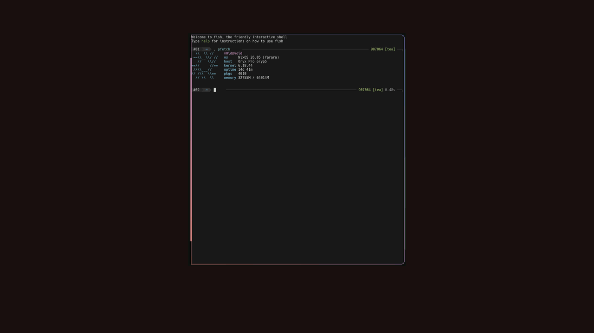
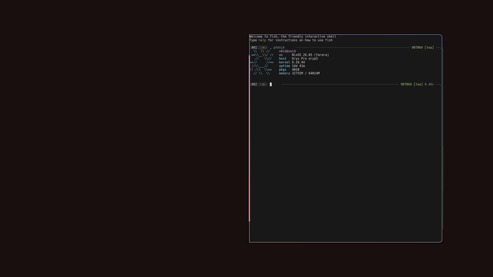
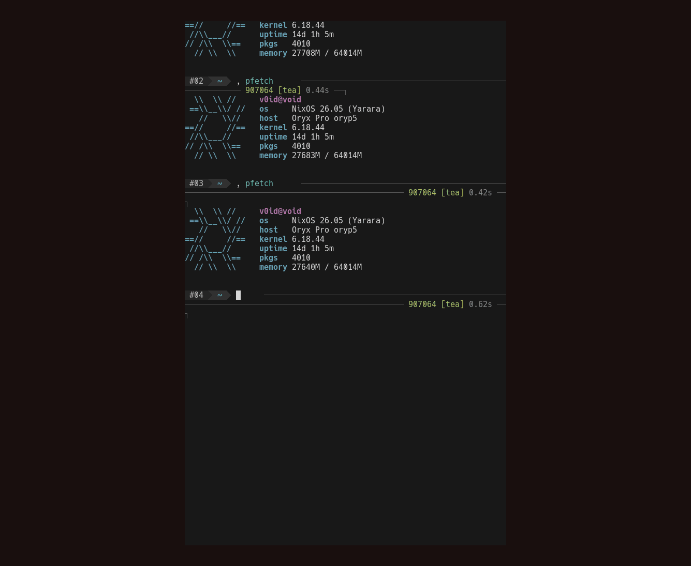

# niri-shaders

Nix + Python generator and GLSL validator for [niri](https://github.com/YaLTeR/niri)
custom-shader window animations (window-open / window-close / window-resize).

## Showcase

<details>
<summary>Unhook — window unhooks from the top and falls on an arc</summary>



</details>

<details>
<summary>Shredder — slides up into a shredder; strips tumble down</summary>



</details>

<details>
<summary>Voronoi — throws window to the screen edge, cracks and shards fly away/summary>



</details>

<details>
<summary>CRT resize — barrel distort + tear as the window steps through sizes</summary>



</details>

Set `programs.niri.shaders.shaderProfile` to `unhook-only`, `shredder-only`, or
`voronoi-only`, apply with `nix-scout switch niri`, then close a window to see
the live version.

## Usage

Add the flake input and pull in the Home Manager module:

```nix
inputs.niri-shaders.url = "github:mikenrafter/niri-shaders";
inputs.niri-shaders.inputs.nixpkgs.follows = "nixpkgs";
```

```nix
# home-manager module list
modules = [ inputs.niri-shaders.homeManagerModules.default ];
```

Enable it and pick a profile:

```nix
programs.niri.shaders = {
  enable = true;
  # "full" | "simple" | "unhook-only" | "shredder-only" | "voronoi-only"
  shaderProfile = "full";
};
```

Point your niri config at the generated KDL instead of embedding shaders
inline:

```
include "~/.config/niri-shaders/animations.kdl" optional=true
```

That's it — `home-manager switch` renders `animations.kdl`, niri picks it up
on the next config reload. Your niri build also needs the 3 patches in
`patches/` applied (see [Layout](#layout)) for the shaders to compile.

## Layout

- `niri-shader-anims.nix` — animation tuple registry (GLSL bodies, durations,
  probabilities, `full`/`simple`/showcase-only profiles).
- `niri-shader-lib.nix` — assembly library: seed-routing codegen, profile
  duration math, the baked-Voronoi derivation, and `readNiriShaderCompileInfo`
  (extracts `#version`/prelude/epilogue from a niri source tree).
- `niri-shaders.nix` — thin assembler; `import ./niri-shaders.nix { pkgs, niriPkg, shaderProfile }`
  returns `{ windowClose, windowOpen, windowResize, durations }`.
- `niri-shader-check.nix` — build-time validator: compiles each assembled
  shader through `glslangValidator` (same wrapping niri itself uses) and
  enforces the seed-scaling isolation invariant on close/open bodies.
- `niri-shader-glsl-compile.py`, `gen-voronoi-bake.py`, `niri-voronoi-bake.nix`
  — supporting compile/bake scripts.
- `niri-shader-gif.py` — headless 50 fps seamless GIF exporter (moderngl).
- `showcase/` — rendered GIFs + `assets/` source textures for regeneration.
- `niri-glslviewer.py`, `voronoi-glsl-harness.c`, `voronoi-shader-test.py` —
  interactive/offline shader dev tooling.
- `niri-animations-spec.md` — design spec for the shipped animations.
- `patches/` — the 3 niri GLSL patches this generator's output requires:
  `niri-glsl-es300.patch` (GLSL ES 3.00 output), `niri-is-floating-prelim.patch`,
  `niri-window-uniforms.patch`. **Whatever niri package you actually run also
  needs these same 3 patches applied** — this repo's own validator applies
  its bundled copies internally to `pkgs.niri` for compile-info purposes
  only; it does not patch or ship a patched niri build.
- `home-module.nix` — Home Manager module: renders the full `animations { ... }`
  KDL block (durations + GLSL bodies) into `~/.config/niri-shaders/animations.kdl`
  via `xdg.configFile`. Point your real niri config at it with niri's native
  `include` directive instead of embedding shaders inline:
  ```
  include "~/.config/niri-shaders/animations.kdl" optional=true
  ```

## Nix

- `lib.mkShaders` / `lib.mkShaderCheck` — the raw `niri-shaders.nix` /
  `niri-shader-check.nix` functions, for direct Nix-level use.
- `lib.anims.durationMs` — per-animation wall-clock lengths (ms).
- `lib.profileDurations { pkgs, shaderProfile }` — compositor `duration-ms`
  for a profile (max over that profile's tuples; same values the HM module
  writes into `animations.kdl`).
- `homeManagerModules.default` — the HM module above (options:
  `programs.niri.shaders.enable`, `.shaderProfile`).
- `checks.${system}.default` — the GLSL validation-check derivation (both
  `full` and `simple` profiles), built against plain `pkgs.niri`. Run it with
  `nix flake check`.
- `devShells.${system}.default` — python3, glslang, glslviewer.

## Regenerating the GIFs

Base images live in `showcase/assets/`:

| File | Role |
|------|------|
| `terminal-example.png` | Window texture for close clips |
| `dms-wallpaper.png` | Solid DMS backdrop (`#1a1110`) |
| `small-terminal.png` / `medium-terminal.png` / `large-terminal.png` | CRT resize chain |

Needs `python3` + `moderngl` + `pillow`, `ffmpeg`, and a built shader store.
`--duration-ms` must match `lib.anims.durationMs` / the profile's
`lib.profileDurations` (same values the Home Manager module writes into
`animations.kdl`):

```bash
# Build a per-profile store (writes windowClose.glsl / windowResize.glsl)
NIRI_SHADER_STORE=$(nix build --no-link --print-out-paths --impure --expr '
  let pkgs = import (builtins.getFlake "path:'"$(pwd)"'").inputs.nixpkgs { system = "x86_64-linux"; };
  in pkgs.callPackage ./niri-shader-check.nix {
    niriPkg = pkgs.niri; shaderProfile = "unhook-only"; shaderProfiles = [ "unhook-only" ];
  }')

NIRI_SHADER_STORE=$NIRI_SHADER_STORE python3 niri-shader-gif.py windowClose \
  --texture showcase/assets/terminal-example.png \
  --backdrop showcase/assets/dms-wallpaper.png \
  --duration-ms 900 \
  --out showcase/unhook-close.gif
```

Repeat with `shredder-only` / `3000`, `voronoi-only` / `1200 --layout right-half`,
and `simple` + `windowResize` / `1000` with the three terminal sizes.
