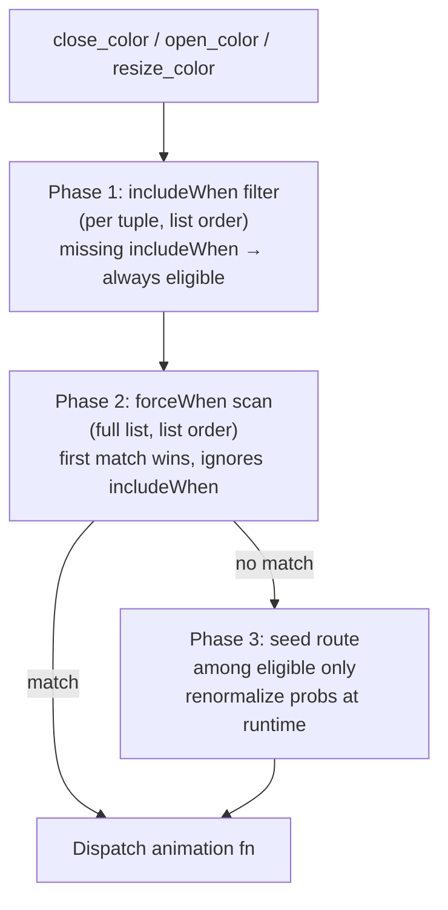

# Niri Window Animation Spec

## Niri Custom-Shader API

### Open / Close shaders

Available uniforms:

| Uniform | Type | Description |
|---|---|---|
| `niri_clamped_progress` | `float` | Animation progress t ∈ [0, 1] |
| `niri_random_seed` | `float` | Per-event random value ∈ [0, 1] |
| `niri_geo_to_tex` | `mat3` | Transform from geo-space coords to texture UV |
| `niri_tex` | `sampler2D` | Window texture |
| `niri_window_size` | `vec2` | Logical window size (alias of geo size for close/open) |
| `niri_window_pos` | `vec2` | Window top-left in output-relative logical coords |
| `niri_output_size` | `vec2` | Logical output/view dimensions |
| `niri_is_tabbed` | `float` | `1.0` if column is tabbed, else `0.0` |
| `niri_total_columns` | `float` | Total columns in the workspace |
| `niri_windows_in_column` | `float` | Windows in this window's column |
| `niri_window_index_in_column` | `float` | 0-based index of this window in its column |
| `niri_columns_in_workspace` | `float` | Same as `niri_total_columns` (ergonomic alias) |
| `niri_column_index_in_workspace` | `float` | 0-based index of this column in the workspace |

Function signatures (niri calls these by name):

```glsl
vec4 open_color(vec3 coords_geo, vec3 size_geo)   // window-open
vec4 close_color(vec3 coords_geo, vec3 size_geo)  // window-close
```

- `coords_geo.xy` — pixel coordinate in [0,1]² normalized geo space
- `size_geo.xy` — window dimensions in pixels
- pixel position in pixels = `coords_geo.xy * size_geo.xy`

Layout uniforms come from `patches/niri-window-uniforms.patch`. `niri_window_pos` is
**view-relative** (window geo minus frozen view origin captured at animation start) so
close shaders stay stable when the last column is removed mid-animation. Floating windows
receive default column context (zeros, `niri_is_tabbed = 0`).

### Resize shader

**Completely different API** — no `niri_tex`, `niri_geo_to_tex`, or `niri_random_seed`.

| Uniform | Type | Description |
|---|---|---|
| `niri_clamped_progress` | `float` | Animation progress t ∈ [0, 1] |
| `niri_progress` | `float` | Raw progress (may exceed [0,1] for spring curves) |
| `niri_tex_prev` | `sampler2D` | Window content at OLD (pre-resize) size |
| `niri_geo_to_tex_prev` | `mat3` | curr_geo → prev texture UV |
| `niri_tex_next` | `sampler2D` | Window content at NEW (post-resize) size |
| `niri_geo_to_tex_next` | `mat3` | curr_geo → next texture UV |
| `niri_curr_geo_size` | `vec2` | Animated geometry size (interpolated between old and new) |
| `niri_curr_geo_to_prev_geo` | `mat3` | Transform from curr_geo to prev geometry |
| `niri_curr_geo_to_next_geo` | `mat3` | Transform from curr_geo to next geometry |
| `niri_input_to_curr_geo` | `mat3` | Input coords → curr_geo |
| `niri_window_pos` | `vec2` | Window top-left in output-relative logical coords |
| `niri_output_size` | `vec2` | Logical output/view dimensions |

Function signature:

```glsl
vec4 resize_color(vec3 coords_curr_geo, vec3 size_curr_geo)
// size_curr_geo = vec3(niri_curr_geo_size, 1.0)
```

**No `niri_random_seed`** — derive a stable per-resize seed from a matrix coefficient:
```glsl
float seed = fhash_r(niri_geo_to_tex_next[0].x * 73.1 + niri_geo_to_tex_next[1].y * 41.3);
```

Default resize behavior is a cross-fade: `mix(niri_tex_prev, niri_tex_next, t)`.

---

## Shader Files

Shaders are assembled from three Nix modules:

| File | Role |
|---|---|
| `home/niri-shader-anims.nix` | Animation GLSL bodies + `simple` / `full` profile tuple lists (`includeWhen`, `forceWhen`, nominal `prob`) |
| `home/niri-shader-lib.nix` | `mkSeedRouter`, `assembleShader`, prob validation, Voronoi bake drv |
| `home/niri-shaders.nix` | Thin assembler — picks profile, wires bake constants, returns `{ windowOpen, windowClose, windowResize, durations }` |

Animation B/V Voronoi geometry is baked at build time — see **Voronoi Bake** below.
Generated constants live in `home/niri-voronoi-bake.nix` (from `home/gen-voronoi-bake.py`).

Interpolated into `home/niri.nix` via a `let shaders = import ./niri-shaders.nix;` binding.

---

## Shader Routing

`mkSeedRouter` in `home/niri-shader-lib.nix` generates `close_color`, `open_color`, and
`resize_color` with three-phase conditional routing (all event classes):



1. **includeWhen** — optional GLSL bool predicate per tuple; absent = always eligible. Filters the seed-routing pool only.
2. **forceWhen** — optional GLSL bool predicate; scanned on the **full** declaration list in index order; first match returns immediately, bypassing includeWhen and seed bands.
3. **Seed routing** — sum nominal `prob` weights of **eligible** tuples only; `s = route_seed * total`; walk cumulative bands; remap `local_seed = (s - bandStart) / bandWidth`.

**Route seed**: close/open use `niri_random_seed`; resize derives a stable hash from `niri_window_pos` (resize preludes omit `niri_random_seed`).

**Probabilities**: nominal weights are declared in Nix (`fillDefaultProbs` fills unspecified entries). At runtime, weights are renormalized over eligible tuples only — e.g. when voronoi tuples fail the width gate, unhook/shredder/ngon absorb the full band.

**Fallback**: if `total == 0` after filtering, dispatch the first tuple in the list.

### Profile rules (`home/niri-shader-anims.nix`)

**`simple` profile** — close: unhook + shredder; open: ngon only; resize: CRT rip.

| Tuple | Rules |
|---|---|
| `close_shredder` | `forceWhen`: `niri_is_tabbed == 1.0 && niri_windows_in_column > 1.0` |
| `close_unhook_fall`, `ngon_reveal`, `resize_crt_distort` | none |

**`full` profile** — extends `simple`; adds voronoi close/open tuples.

| Tuple | Rules |
|---|---|
| `close_voronoi_crumble`, `open_voronoi_shatter` | `includeWhen`: `(niri_window_size.x / niri_output_size.x) < 0.7` |
| `close_shredder` | same tabbed `forceWhen` as simple |
| unhook, ngon, CRT | none |

Nominal close probs (`full`): shredder `0.5`; unhook and voronoi share the remainder equally (`0.25` each when voronoi is eligible). Nominal open prob (`full`): ngon `0.45`; voronoi `0.55` when eligible. When voronoi is ineligible, its weight is excluded before renorm.

Single-animation lists still emit the same three-phase structure (eligibility trivially true, no force blocks).

---

## Window-Open Animations

**Duration**: 1000ms, curve: `linear` (see `home/niri.nix`)

**Active**: **V** — vertex-baked Voronoi centre crack → outward shatter reveal
(`open_anim_v`; `open_color` routes 100% here). Legacy A/B preserved in
`windowOpenLegacy` (reference only).

Seed-band routing for animations A/B is disabled on the active path; `niri_random_seed`
still drives variant, explode/crumble mode, crack coverage, and spin direction.

### Compositor note — no underlay texture

Niri open shaders receive only `niri_tex` (the opening window). There is no
`niri_tex_under` or desktop snapshot uniform (`opening_window.rs` passes a single
texture binding). Animation B therefore **does not** sample real desktop/other-window
pixels. Instead:

- Pixels the shader leaves transparent (`alpha = 0`) show whatever the compositor
  has already drawn beneath the opening tile (real desktop / other windows).
- Flying shard pixels become visible only after their cell centre exits the window
  rectangle; they render as **procedural glass** (translucent gray vertical gradient),
  evoking shattered overlay glass rather than a literal desktop texture.

This matches the intended read: the space was shattered, revealing the window — without
requiring upstream niri changes.

---

## Animation A — SDF Shape Reveal

**Status**: implemented (`open_color` SDF path in `home/niri-shaders.nix`)

SDF shape (circle / 3-lobe star / 4-lobe star / 5-lobe star / pill) scales from
center with rotation, ripple wake ring, dissolves to full opacity over last 12%.

Shape selected by `niri_random_seed` in five equal sub-bands within [0, 0.5):
`shape_seed = niri_random_seed / 0.5` → bands [0,0.2), [0.2,0.4), … [0.8,1.0).

---

## Animation B — Center Crack → Shatter Reveal

**Status**: legacy reference (`open_anim_b` in `windowOpenLegacy`; superseded by Animation V open)

Inverse of close Animation B phases 3–4 (crack spread + crumble/explode). **No**
throw, squish, or wall contact. Cracks emanate from the window centre; shards fly
**away** from the centre, uncovering the opening window underneath.

### Visual read

1. The tile region starts fully transparent — the real desktop shows through.
2. Voronoi crack lines appear and spread outward from the centre, drawn at **70%**
   opacity of the real window texture (not 30% like close B).
3. Voronoi cells detach in centre-distance order and accelerate **radially outward**
   (explode) or outward-with-fall (crumble).
4. While a shard’s cell centre is still inside the window rectangle, that cell
   contributes **0% opacity** everywhere — the window continues to show through
   beneath. Once the centre exits the window bounds, the shard becomes visible as
   translucent “glass” (light/dark gray vertical gradient).
5. As shards clear the aperture, the static (unreleased) regions show the real
   window texture. By `t = 1` the full window is opaque with no cracks or glass.

Shards **never** fly toward the window.

### Mode selection

`explode_mode = fract(local_seed * 3.1 + 0.6) < 0.5` (same coin flip as close B).

| Mode | Cells 0–11 | Cells 12–15 |
|---|---|---|
| **Explode** | Radial blast waves from centre | Crumble outward (tail) |
| **Crumble** | All 16 crumble outward from centre | — |

The last four cells always use crumble physics even in explode mode (same split as
close B).

### Phase timing (1000ms total)

No travel or squish phases. Edit boundaries in the Nix let-block; inject reciprocals
at build time (same pattern as close B).

| Phase | t range | ms |
|---|---|---|
| Crack spread | [0.000, 0.350] | 0–350 |
| Shatter (crumble / explode) | [0.350, 1.000] | 350–1000 |
| Full-window settle | [0.880, 1.000] | 880–1000 |

Constants (proposed Nix names):

| Name | Value | Role |
|---|---|---|
| `OPEN_B_T_CRACK_END` | 0.35 | crack spread ends / first release anchor |
| `OPEN_B_SETTLE_START` | 0.88 | cross-fade cracks/glass → full window (mirrors SDF A) |

### Crack spread

**Origin**: window centre in pixel space.

```
crack_origin = vec2(0.5 * size_geo.x, 0.5 * size_geo.y)
```

**Pattern**: baked Voronoi shards only (same 16-cell / 6-variant bake as close B).
No radial-line alternate — centre symmetry makes Voronoi the natural fit.

**Spread**: crack front radius expands linearly over the crack phase.

```
cfr = cov * diag * clamp(t / OPEN_B_T_CRACK_END, 0, 1)
```

`cov = fract(local_seed * 2.9 + 0.4) * 0.4 + 0.6` — front covers [60%–100%] of
window diagonal by crack end (some patterns do not reach corners).

**Crack visibility**: only pixels with `dist(px, crack_origin) < cfr` may show
cracks. Inside the front:

| Pixel type | Output |
|---|---|
| Voronoi edge (`edge < 1.5 px`) | `niri_tex` × **0.7** alpha |
| Gap (`gap > 1.0 px²`) | transparent |
| Solid cell interior | transparent |

Uncracked interior stays transparent so the desktop remains visible until shards
depart. This is the open counterpart to close B’s inverse mask (crack-dimmed lines
on an otherwise solid window).

### Shatter — release ordering

**Ranking**: squared distance from window centre only (no left/right corner, no
`BAKED_USE_TOP`). Closest cells release first.

```
center = vec2(0.5 * sz.x, 0.5 * sz.y)
center_d2(cell) = dot(cc[cell] - center, cc[cell] - center)
rank = count of cells k where center_d2(k) <= center_d2(cell)  // 0 = innermost
```

Bake as `BAKED_CENTER_RANK[variant * 16 + cell]` in `gen-voronoi-bake.py` (no
`gl` dimension — centre rank is direction-agnostic).

**Stagger** (crumble mode, all 16 cells):

```
t_release(cell) = OPEN_B_T_CRACK_END
                + (rank / 15.0) * 0.55 * (1.0 - OPEN_B_T_CRACK_END)
```

**Explode waves** (cells 0–11 by centre rank): same 3×4 wave structure as close B
but anchored at `OPEN_B_T_CRACK_END` and directed radially:

| Wave | rank range | delay (ms) | vel scale |
|---|---|---|---|
| 0 | 0–3 | 0 | 1.0 |
| 1 | 4–7 | 60 | 0.6 |
| 2 | 8–11 | 140 | 0.8 |

Per-cell jitter within wave: `+ rank_in_wave * 10 ms`.

Cells 12–15: crumble tail anchored at first explode time + tail offsets (same
140 + (rank−12)×25 ms pattern as close B explode tail).

### Shatter — fragment physics

Shared with close B where noted; directions inverted to **outward from centre**.

**Explode** (rank < 12):

```
dir = normalize((cc[i] - center) + baked_rnd(variant, i) * 0.18)
v0  = dir * explode_v0 * vel_scale * (0.9 + 0.2 * baked_rv_speed(...))
co  = v0 * dt + vec2(0, explode_gravity * dt²)
ro  = spin_sign * (4.0 + baked_rv_rot(...) * 8.0) * dt
```

`explode_v0 = length(sz) * 9.0`, `explode_gravity = sz.y * 18.0` (close B parity).
`spin_sign` from `fract(local_seed * …) < 0.5` → ±1 (decorative tumble).

**Crumble** (rank ≥ 12 in explode mode, or all cells in crumble mode):

```
dir = normalize((cc[i] - center) + vec2(0, -0.15))   // slight upward bias
co  = dir * (diag * 0.35 * (0.4 + 0.5 * rv_speed)) * dt
    + vec2(0, crumble_y_scale * dt²)
ro  = spin_sign * (1.0 + baked_rv_rot(...) * 3.0) * dt
```

`crumble_y_scale = sz.y * 42.0` (close B parity). Outward speed scales with
diagonal so large windows throw shards farther.

### Shard visibility rule (glass vs invisible)

Per released cell `i` after `t_release`:

```
shard_center_screen = cc[i] + co[i]
inside = shard_center_screen inside [0, sz.x] × [0, sz.y]
```

| Condition | Pixel output for owned region |
|---|---|
| `inside` | **`niri_tex` reveal** (shard overlay gone; not `alpha=0`) |
| `!inside` | procedural glass (see below) |

Ownership uses the same ghost-neighbour inverse transform as close B: invert
`co[i]` / `ro[i]`, test `baked_owner_cell_runtime`, gap rejection, deepest-`co.y` tie-break.

Unreleased cells (`dt_cell[i] == 0`): static fallback — `niri_tex` with crack
overlay (0.7 on edges inside crack front).

### Glass shard appearance

When `!inside`, sample no texture. Colour from shard-local vertical gradient in
the inverse-mapped cell frame:

```
t_grad = clamp((qo.y - (cc[i].y - half_h)) / cell_height, 0, 1)
rgb    = mix(vec3(0.52), vec3(0.82), t_grad)          // dark → light gray
alpha  = 0.28 + 0.10 * baked_rv_speed(variant, i)     // translucent
```

Premultiplied output: `vec4(rgb * alpha, alpha)`. Optional subtle `ro` rotation
on the gradient axis via the existing inverse-rotation of `qo`.

### Settle phase

For `t ≥ OPEN_B_SETTLE_START`, cross-fade remaining crack dimming and any lingering
glass toward full `niri_tex` at alpha 1 (same `smoothstep` idea as SDF A’s last 12%).

At `t = 1`: single `texture2D(niri_tex, …)` fast path.

### Voronoi bake additions (Animation B open)

Reuses existing bake arrays (`BAKED_CC_NXY`, `BAKED_RV_*`,
`BAKED_RND_*`). **New**:

| Array | Size | Content |
|---|---|---|
| `BAKED_CENTER_RANK` | 96 (6×16) | centre-distance release rank per variant×cell *(implemented)* |

Regenerate: `python3 home/gen-voronoi-bake.py > home/niri-voronoi-bake.nix`

Close-only arrays (`BAKED_CRUMBLE_RANK`, `BAKED_EXPLODE_RANK`, `BAKED_USE_TOP`,
corner/top d²) remain close-B-only; open B reads `BAKED_CENTER_RANK` exclusively.

### Performance — mirror close B fast paths

Implement as `open_anim_b` with the same cost controls documented for
`close_anim_b`:

| Fast path | When |
|---|---|
| **Static crack** | `t < OPEN_B_T_CRACK_END` and no cell has `dt > 0` — single owner + gap + edge LUT + texture; no physics/ownership loops |
| **Released-cells-only ownership** | after first release — skip `dt_cell == 0` in the 16× loop; static-owner fallback for unreleased regions |
| **AABB cull** | per released cell before inverse transform (`0.35 × sz` half-extents) |
| **Early `co.y` skip** | same deepest-fallen winner shortcut |
| **Baked geometry** | no runtime `vhash`, no 16×16 owner search |
| **Settle fast path** | `t ≥ OPEN_B_SETTLE_START` — direct texture, no loops |

Profiler: add `open_anim_b` entry to `home/glsl-profile.py` with loop overrides
`[16, 16]` (physics + ownership), conservative like close B.

### Entry point dispatch

```glsl
vec4 open_color(vec3 coords_geo, vec3 size_geo) {
    float seed = niri_random_seed;
    float t    = niri_clamped_progress;
    if (seed < 0.5)
        return open_anim_a(coords_geo, size_geo, t, seed / 0.5);
    else
        return open_anim_b(coords_geo, size_geo, t, (seed - 0.5) / 0.5);
}
```

Refactor current SDF body into `open_anim_a`; share `fast_sincos` / bake constants
with close shader via `${voronoiBake.glslConstants}` in `windowOpen`.

### Constants summary (proposed)

| Parameter | Value |
|---|---|
| Duration | 1000 ms |
| Seed band | [0.5, 1.0) |
| `OPEN_B_T_CRACK_END` | 0.35 |
| `OPEN_B_SETTLE_START` | 0.88 |
| Crack edge threshold | 1.5 px |
| Crack line opacity | 0.7 |
| Voronoi cells / variants | 16 / 6 |
| Explode tail cells | last 4 (rank ≥ 12) |
| Glass alpha range | 0.28–0.38 |

---

## Window-Close Animations

**Duration**: compositor runs for `max(durationMs)` across the active profile's close list
(3000 ms in `full` — shredder envelope; see `durations.closeMs` from `home/niri-shaders.nix`).
Curve: `linear` (see `home/niri.nix`).

**Active (`full` profile)**: seed-routed multi-animation close via `close_color`:

| Animation | GLSL fn | Nominal prob | Notes |
|---|---|---|---|
| **A** — Unhook & fall | `close_unhook_fall` | `0.25` (default fill) | 900 ms |
| **C** — Shredder | `close_shredder` | `0.5` | 3000 ms; **forced** in tabbed columns with multiple windows |
| **V** — Voronoi throw → crack → crumble | `close_voronoi_crumble` | `0.25` (default fill) | 1200 ms; eligible only when `(niri_window_size.x / niri_output_size.x) < 0.7` |

**Active (`simple` profile)**: unhook + shredder only (no voronoi tuple).

`niri_random_seed` drives per-animation variation (variant, crack coverage, spin, etc.).
Layout uniforms drive routing overrides and voronoi travel/crumble mode — see **Shader Routing**
and **Animation V** below.

Legacy monolithic `#if 0` bodies in older shader snapshots mapped the same A/B/C seed bands;
the live path uses profile tuple lists + `mkSeedRouter` instead.

---

## Animation V — Vertex-Baked Voronoi Close

**Status**: active in `full` profile as `close_voronoi_crumble` (`home/niri-shader-anims.nix`);
gated by width-ratio `includeWhen` and subject to shredder `forceWhen` override in tabbed
multi-window columns. Open counterpart: `open_voronoi_shatter` (same width gate).

### Field definition

The Voronoi field is defined by **16 baked cell-centre vertices** per seed variant
(`BAKED_CC_NXY`) plus existing rank / random tables (`BAKED_CRUMBLE_RANK`,
`BAKED_EXPLODE_RANK`, `BAKED_RV_*`, `BAKED_RND_*`). No edge-midpoint mesh is baked —
gap, edge, and owner queries use the runtime 16-loop nearest-centre metric on those
vertices (same as Animation B close).

### Phases (1200 ms total)

Same timing as Animation B close:

| Phase | t range | ms |
|---|---|---|
| Travel to wall | [0.000, 0.0833] | 0–100 |
| Impact squish | [0.0833, 0.125] | 100–150 |
| Stick + crack spread | [0.125, 0.2917] | 150–350 |
| Crumble | [0.2917, 1.000] | 350–1200 |

Throw direction: **always left wall** (`gl = true`). Travel/squish remap uses layout-aware
`travel_end = niri_window_pos.x / sz.x` so content reaches screen x=0 at end of travel (not
the legacy `0.5 * width` heuristic). Squish pins `B = travel_end` while `A` compresses.

Crumble vs explode mode: `explode_mode = (niri_window_pos.x / max(niri_output_size.x, 1.0)) >= 0.5`
(right-half windows explode; left-half crumble). Open voronoi keeps seed-based `explode_mode`.

### Static crack fast path

For `t ∈ [T2, T3)` (and explode mode at `t == T2` before first blast): full window
visible with inverse crack mask (0.7 on Voronoi edges inside spreading front). **No**
open-B `gap > 1.0` transparent gate — interiors stay opaque.

Single `baked_owner_cell_runtime` is not needed on this path (whole-window texture
with edge dimming only).

### Crumble ownership

1. Precompute `cc[16]` and per-cell physics once (`co`, `rc`, `rs`, `dt_cell`).
2. One static owner lookup at `q_stat` for fallback.
3. Ownership loop iterates **released cells only** (`dt_cell[i] > 0`): inverse rigid
   transform + vertex owner test + deepest-`co.y` tie-break.
4. Unreleased regions: static fallback to `static_owner` at `q_stat`.

Profiler: `python3 home/glsl-profile.py windowClose` — loop annotations on
`close_anim_v` use `@profile-loop bound=16 effective=6` on the ownership pass.

### Bake

Reuses `home/niri-voronoi-bake.nix` unchanged (~34 KB `glslConstants`). Sixteen
centres suffice for the whole-window field and per-shard inverse mapping; edge
midpoints are not required.

---

## Animation V — Vertex-Baked Voronoi Open

**Status**: active (`open_anim_v` in `home/niri-shaders.nix`; `open_color` routes 100% here)

Inverse of `close_anim_v` / Animation B open: centre crack spread → outward shatter
reveal. **No** travel, squish, or wall contact. Legacy `open_anim_a` / `open_anim_b`
remain in `windowOpenLegacy` for reference.

### Field definition

Same 16 baked cell-centre vertices per seed variant (`BAKED_CC_NXY`) as close V.
Release ordering uses `BAKED_CENTER_RANK` (centre-distance rank). Gap, edge, and
owner queries use the runtime 16-loop nearest-centre metric on those vertices.

### Phases (1000 ms total)

| Phase | t range | ms |
|---|---|---|
| Crack spread | [0.000, 0.350] | 0–350 |
| Shatter (crumble / explode) | [0.350, 1.000] | 350–1000 |
| Full-window settle | [0.880, 1.000] | 880–1000 |

### Static crack fast path

For `t < OPEN_B_T_CRACK_END` (and explode mode at `t == T_CRACK` before first blast):
only Voronoi **edges** inside the spreading crack front show `niri_tex` at **0.7**
opacity; gap interiors and uncracked regions stay **transparent** (open-B vanish gate).
No physics or ownership loops.

### Shatter — territory model (not sliding lattice)

The Voronoi field is **fixed on the window rectangle** (`coords_geo` ∈ [0,1]²). Cell
centres do not migrate outward on screen — only **rigid shards** move via `co[i]` /
`ro[i]`.

Per pixel at `q_stat`:

```
territory = baked_owner_cell_runtime(variant, q_norm_stat)  // fixed lattice
```

| `dt_cell[territory]` | Flying shard inverse-hit? | Output |
|---|---|---|
| `0` (attached) | — | **Transparent** (opacity 0); crack **edges only** at 0.7 |
| `> 0` (detached) | yes | **#888888 @ 0.5** flying piece (moves with `co`/`ro`) |
| `> 0` | no (shard flew away) | **Full-opacity** `niri_tex` reveal at `q_stat` |

Flying shards are composited **above** attached territories. Crack lines use
`OPEN_V_CRACK_OP = 0.7`; shard fill never uses full window opacity while attached.

**Do not** re-assign pixels to outer unreleased cells when inner cells release — that
produced the “yellow patch sliding to the edge / green voronoi expanding inward” bug.

Flying-shard overlap uses the same inverse-transform + depth competition as close V
(released cells only).

### Assumptions audit (open V)

| # | Assumption | If wrong |
|---|---|---|
| 1 | `niri_clamped_progress` is linear 0→1 over 1000 ms | Physics timing off |
| 2 | `t` and release delays share normalized units (`ms × inv1000`) | Shards release too early/late |
| 3 | Transparent pixels show **desktop under tile**, not window | `alpha=0` on released cells = invisible animation, not reveal |
| 4 | Static crack: only ~1.5 px Voronoi edges visible at 0.7 opacity | Crack phase looks empty (expected — shatter carries the read) |
| 5 | Attached shard **fill** transparent; cracks **0.7**; flying **#888888 @ 0.5**; cleared territory **full window** | Inverted opacity = invisible animation |
| 6 | `open_v_settle` from t=0.88 cleans up cracks/glass — not the primary reveal | Settle masked broken middle when #5 failed |
| 7 | First open triggers lazy GLSL compile (Niri patch) | Initial open “lags” before animation starts — not shader logic |
| 8 | No `niri_tex_under` — glass is procedural, not desktop texture | Cannot sample real backdrop |

### Debug mode

In `home/niri-shaders.nix` let-block:

```nix
debugOpenV = true;   # flip on for diagnosis
debugOpenVMode = 3;  # 1=progress heat, 2=owner hue, 3=state colors
```

Then `home-manager switch --flake .` and open windows. Mode 3 colors:

| Color | State |
|---|---|
| Dark gray | Transparent (desktop hole) — attached fill or uncracked |
| Cyan | Crack line at 0.7 opacity |
| Gray (50%) | Flying detached piece (#888888) |
| Orange | Territory cleared — full window reveal |

### Flying shard appearance

Flat **#888888** at **0.5 alpha** (premultiplied). Constants in Nix let-block:
`OPEN_V_FLYING_RGB`, `OPEN_V_FLYING_ALPHA`, `OPEN_V_CRACK_OP = 0.7`.

### Settle

`open_v_settle()` cross-fades cracks/glass toward full `niri_tex` from
`OPEN_B_SETTLE_START`. Fast path at `t ≥ 1`.

Profiler: `python3 home/glsl-profile.py windowOpen` — loop overrides `[16, 16, 6]`.

---

## Animation A — Unhook & Fall

**Status**: implemented

Projectile physics. Window launches in a random direction (always with upward component), follows a parabolic arc. Fade starts at apex, reaches zero by t=1. Action completes by ~t=0.39 (350ms); remainder is blank at 900ms total duration.

**Constants**:
- launch velocity: 240 px
- gravity: 700 px/t² downward

---

## Animation B — Throw → Crack → Stick → Crumble

**Status**: implemented

### Phase Timing (900ms total)

| Phase | t range | ms |
|---|---|---|
| Travel to wall | [0.000, 0.222] | 0–200ms |
| Impact squish | [0.222, 0.278] | 200–250ms |
| Stick + crack spread | [0.278, 0.611] | 250–550ms |
| Crumble | [0.611, 1.000] | 550–900ms |

### Direction

`local_seed < 0.5` → throw left; `local_seed >= 0.5` → throw right. Vertical throws excluded (stick/crumble reads poorly on top/bottom edges).

### Phase 1: Travel

Translate window toward impact wall by `size_geo.x * 0.5` pixels over t ∈ [0, 0.222]. Linear motion.

### Phase 2: Impact Squish

Compress 10% on x-axis from the impact edge side. Squish persists for the remainder of the animation (phases 3 and 4). Does not un-squish.

### Phase 3: Stick + Crack Spread

Window is stationary and squished. Crack pattern appears and spreads.

**Crack visual**: inverse mask — crack pixels render at 0.3 opacity, uncracked pixels at 1.0.

**Crack origin**: randomized along the impact edge.
- `crack_origin.x` = 0 (left wall) or `size_geo.x` (right wall)
- `crack_origin.y` = `fract(local_seed * 5.7 + 0.3) * size_geo.y`

**Crack pattern type** (50/50 from `fract(local_seed * 3.1 + 0.6) < 0.5`):
- **Radial**: lines radiating from crack_origin, angular jitter per line, 2–4 px width
- **Voronoi shards**: 16 cell centres from build-time bake (`home/niri-voronoi-bake.nix`, 6 seed variants); crack = pixels near Voronoi edge (LUT bisector distance < 1.5 px)

**Crack spread**: crack only visible within `dist(px, crack_origin) < crack_front_radius`. Front expands linearly over the stick phase. `crack_speed` randomized so front covers [60%–100%] of window diagonal by stick end — some cracks don't reach the far corner.

### Phase 4: Crumble

Uses the same Voronoi cell partition as the crack pattern.

**Crumble origin**: bottom corner on the side *opposite* the impact wall.
- Right-wall hit → crumble from bottom-left corner
- Left-wall hit → crumble from bottom-right corner

**Stagger**: `t_release(cell) = 0.611 + (dist(cell_center, crumble_origin) / max_diag) * 0.7 * 0.389`
Cells closest to crumble origin detach and fall first.

**Fragment physics** (after `t_release`):
- `dt = t - t_release`
- `offset.x` = small drift away from impact wall
- `offset.y` = `0.5 * 700.0 * dt²` (gravity, same constant as Anim A)

**Tumble**: rotation around cell center, rate ∝ `1 / cell_area_normalized` (smaller = faster).
Direction from fall vector: left+down → CCW, right+down → CW.

Crack overlay (0.3 opacity on crack pixels) persists during fragment fall.

---

## Animation C — Shredder

**Status**: implemented (`close_anim_c` in `home/niri-shaders.nix`)

### Phase Timing (900ms total)

| Phase | t range | ms |
|---|---|---|
| Push upward | [0.000, 0.400] | 0–360ms (whole window slides up) |
| Progressive shred + fall | overlapping from t≈0 | — |
| All strips falling | [0.400, 1.000] | 360–900ms |

Close animation scales C to a 3 s envelope via `CLOSE_C_T_SCALE_C = 2.5` (same shred
timing, longer fall).

### Strip / Piece Grid

- Strip width: `STRIP_W = 75.0` px (strips auto-fit: `ceil(size_geo.x / 75.0)`)
- Segment height: `SEG_H = 150.0` px
- `strip_idx = floor(px.x / STRIP_W)`, `seg_idx = floor(px.y / SEG_H)`
- Piece center: `vec2((strip_idx + 0.5) * STRIP_W, (seg_idx + 0.5) * SEG_H)`

Shredder location: top of the screen (window slides up into a fixed shredder at y=0 in screen space). No visible shredder element — purely implied by the strip-fall effect.

### Phase 1: Progressive Shred

Whole window translates upward: `sample_y = cg.y + slide_frac` where
`slide_frac = min(t, 1) / SLIDE_END`.

Each piece has a release time when its top row enters the shredder:
```
t_release = SLIDE_END * (seg_idx * SEG_H / size_geo.y)
```
Top row releases at t≈0, bottom row at t≈0.40.

Before `t_release`: pixel renders as part of sliding window.

Cut-line guard: pixels above `ceil(gi_current)*SEG_H/sz.y − slide_frac` in geo-space
must not sample the sliding window (prevents ghosting behind falling pieces).

### Phase 2: Strip Fall + Flutter

After `t_release`, `dt = t - t_release`:

- `fall.y = -V0_UP * dt + 0.5 * GRAVITY * dt²` (upward launch then gravity)
- `fall.x = (fract(float(strip_idx) * 127.1 + float(seg_idx) * 311.7 + ls*43.7) - 0.5) * DRIFT_MAX * dt`
- Y-tumble: continuous spin around strip vertical axis; back-face culled when `cos(φ) ≤ 0`
- Z-flutter: `θ = 0.18 * sin(15·dt + hash)` wobble in screen plane
- Chromatic aberration + per-strip whitewash on texture sample

Pieces that fall below the visible output bottom are off-screen. Screen-space
bottom in window-local pixels:

```
off_bottom = max(niri_output_size.y - niri_window_pos.y, size_geo.y)
fall_gone_y = off_bottom + MAX_HALF_H
```

Fall physics time scales up (slide timing unchanged) so the last-released segment
reaches `fall_gone_y` when `t_prog = 1`, inverting the parabolic fall for `dt_need`.

**Below-output early out** — `px.y > fall_gone_y`:

- No released piece AABB can reach this scanline; return transparent before loops.

**Vertical envelope pre-pass** — before the inverse-transform loop:

- One cheap `gi` sweep computes `[piece_ymin, piece_ymax]` of all released segment
  centres ± `MAX_HALF_H`.
- When `px.y` is outside that band, skip the entire Phase 2 strip search (Phase 1 or
  transparent only).

**Per-segment culling** (inside Phase 2):

- Scanline reject: `abs(px.y - center_y) > MAX_HALF_H`.
- Horizontal reach reject: `abs(px.x - nom_strip_x) > dsi_lim * STRIP_W + MAX_HALF_W`
  before entering the strip loop.
- `t < t_rel` break on the outer `gi` loop (monotone release order).

**Dynamic strip search radius** — inner loop bound is fixed at `SCATTER_MAX` (16) for
SPIR-V loop uniformity, but `dsi_lim` skips out-of-range offsets:

```
dsi_lim = min(ceil(0.5 * DRIFT_MAX * dt / STRIP_W) + 1, SCATTER_MAX)
```

Early in a piece's fall (`dt` small) this searches ~3–5 neighbouring strips instead of
33. At `dt ≈ 2.5` (3 s envelope, top segment) `dsi_lim` reaches 16 — required because
`0.5 * DRIFT_MAX * dt` can exceed 15 strip widths.

**Baked build-time constants** — reciprocals and AABB half-extents injected from the
Nix let-block (`GRAVITY_HALF`, `INV_SLIDE_END`, `INV_STRIP_W`, `MAX_HALF_H/W`,
tumble/flutter amplitudes) to avoid runtime `FDiv`.

### Runtime cost trade-offs

| Removed / reduced | Kept |
|---|---|
| Full ±16 strip search on every segment | Dynamic `dsi_lim` guard inside fixed bound |
| Phase 2 on scanlines outside vertical envelope | Per-segment scanline + horizontal reach cull |
| Runtime reciprocals for slide/gravity/AABB | Build-time injected constants |
| Duplicate `cut_screen_y` compute | Single pre-loop value reused in Phase 1 |

Profiler note (`home/glsl-profile.py`): `close_anim_c` uses manual loop multipliers
`[5, 8]` (conservative segment × strip estimates). After the envelope pre-pass and
fixed `SCATTER_MAX` inner bound, SPIR-V structural loops are `[32, 32, …]` — the
profiler warns when overrides diverge from detected structure. Re-tune overrides after
major loop changes.

### Constants (current)

| Parameter | Value |
|---|---|
| `STRIP_W` | 75 px |
| `SEG_H` | 150 px |
| `GRAVITY` | 2400 px/t² |
| `SLIDE_END` | 0.4 |
| `DRIFT_MAX` | 900 px/t |
| `V0_UP` | 500 px/t |
| `SCATTER_MAX` | 16 strips |
| `CLOSE_C_T_SCALE` | 2.5 |

---

## Voronoi Bake (Animation B crack + crumble — close; Animation B shatter — open)

Animation B (close and open) no longer calls `vhash()` at runtime. Cell centres and a crack
edge-distance field are precomputed at Nix build time and injected as GLSL
constants.

### Files

| File | Role |
|---|---|
| `home/gen-voronoi-bake.py` | Generator (Python, float32-accurate `vhash` replica) |
| `home/niri-voronoi-bake.nix` | Generated Nix module exporting `glslConstants` |
| `home/niri-shaders.nix` | Imports bake module; `${voronoiBake.glslConstants}` in `windowClose` |

Regenerate after changing hash logic, cell count, variant count, or LUT resolution:

```bash
python3 home/gen-voronoi-bake.py > home/niri-voronoi-bake.nix
```

### Six seed variants

`local_seed` still drives full per-window entropy for physics (`explode_mode`,
crack coverage, Murmur3 piece randoms). Close B additionally uses `gl` (throw
direction) for corner/top ranks; open B uses centre rank only. Only the **Voronoi geometry**
is quantised:

```glsl
float vs_raw = fract(local_seed * 17.3 + 1.5);
int   variant = int(min(vs_raw * 6.0, 5.999));   // bucket ∈ [0, 5]
```

Each variant is baked at the bucket centre `vs = (variant + 0.5) / 6` using
the same Dave Hoskins hash as the old runtime `vhash()`:

```glsl
vec2 vhash(float i, float s) {
    vec3 p3 = fract(vec3(i, i, i) * vec3(0.1031, 0.1030, 0.0973) + s * 0.137);
    p3 += dot(p3, p3.yzx + 33.33);
    return fract((p3.xx + p3.yz) * p3.zy);
}
```

### Baked data layout

**Cell centres** — 16 per variant, normalised geo `[0,1]²`:

```
cc[i] = BAKED_CC_NXY[(variant * 16 + i) * 2 + {0,1}] * size_geo.xy
```

**Owner lookup** — runtime 16-loop over baked centres (nearest-centre wins):

```
owner = baked_owner_cell_runtime(variant, qo / size_geo)
```

**Gap metric** — runtime 16-loop over baked centres, `sq2 - sq1` in normalised geo²:

```
gap_px = voronoi_gap_norm(variant, qo / size_geo) * min(w, h)²
```

Same `gap > 1.0` pixel² rejection as before (crack-line transparency).

**Edge distance** — runtime two-nearest bisector over baked centres, normalised geo units:

```
edge_px = voronoi_edge_norm(variant, q_orig / size_geo) * min(size_geo.x, size_geo.y)
```

Each query uses the same metric as the old per-fragment
`0.5 * (sq2 - sq1) / |c1 - c2|` pass (previously bilinear-sampled from a 32×32 LUT).

Crack dimming is unchanged: `step(edge, 1.5)` inside the spreading crack front.

### Runtime cost trade-offs

| Removed | Kept |
|---|---|
| 16× `vhash()` per fragment | Physics + ownership loops (crumble / explode only) |
| Baked 32×32 gap + edge LUTs | Runtime 16-loop gap/edge over baked centres |
| Per-pixel bilinear edge LUT sample | Exact two-nearest bisector at query point |
| 16×16 / 32×32 owner LUTs | Runtime 16-loop nearest-centre ownership |
| 16× physics outer loop (centre precompute) | Baked crumble/explode rank tables |
| 16× rank inner loop per physics cell | Baked `rv_speed` / `rv_rot` / `rnd` per variant×cell |
| Runtime Murmur3 hash chain per physics cell | Baked corner/top d² + `use_top` hint per variant×gl×cell |
| Full 16× ownership loop every fragment | Released-cells-only ownership + static fallback |

### Phase-specific fast paths (`close_anim_b`)

**Static crack** — `t ∈ [T2, T3)` and no shard detached yet:

- Default crumble: nothing releases until `T3` (`!explode_mode`).
- Explode: first blast wave fires at `T2`; at `t == T2` all `dt_cell == 0`.
- Early return before centre/physics/ownership loops.
- Single `baked_owner_cell_runtime` + runtime gap at `q_stat`, then edge query + texture.

**Released-cells-only ownership** — crumble and explode after first release:

- Physics loop records `dt_cell[i]`; ownership skips `dt_cell[i] == 0`.
- Unreleased Voronoi regions use one static-owner fallback (`baked_owner_cell_runtime` at
  `q_stat`) instead of 16 identity inversions.
- Early `co[i].y < best_z - 0.5` skip when a deeper fallen shard already won.
- **AABB cull** per released cell: conservative screen-space bounds from
  centre + `co[i]` + rotated half-extents (`0.35 × sz`); skip inverse transform
  when pixel is outside.

**Explode mode** — uses `baked_explode_rank` and baked `use_top` / blast
randoms; static-crack shortcut applies only at `t == T2` (first frame of crack
spread, before any blast piece moves). After `t > T2`, ownership path is the
released-cells loop with AABB culling.

**Baked release rank** — `BAKED_CRUMBLE_RANK` / `BAKED_EXPLODE_RANK` per
`(variant, gl, cell)` replace the runtime 16× rank inner loop. Ranks use
unit-aspect corner distance (`dx² + dy²` in normalised geo). On non-square
windows the GPU still compares `sz.x²·dx² + sz.y²·dy²`, so release ordering can
differ slightly from bake when aspect ratio ≠ 1. Visually negligible for typical
window shapes.

**Baked piece randoms** — `BAKED_RV_SPEED`, `BAKED_RV_ROT`, `BAKED_RND_X/Y` per
`(variant, cell)` at bucket-centre `vs_raw`. Windows whose `local_seed` falls
near a variant boundary may differ slightly from bake (same quantisation caveat
as cell centres).

**Baked corner distances** — `BAKED_CORNER_D2_NORM`, `BAKED_TOP_D2_NORM` per
`(variant, gl, cell)` in unit-aspect normalised geo; scaled at runtime via
`min(sz)²`. `BAKED_USE_TOP` stores the explode blast direction hint
(`top_d2 < corner_d2`, equivalent to `cy < 0.5`); independent of aspect ratio.

The owner lookup uses exact nearest-centre distance in normalised geo (same metric as
gap/edge). On non-square windows pixel thresholds scale by `min(w,h)`; release ranks
may differ slightly from bake when aspect ratio ≠ 1.

### Constants (current)

| Parameter | Value |
|---|---|
| Variants | 6 |
| Cells | 16 (4×4 lattice) |
| GLSL arrays (paged `float[16]`) | `BAKED_CC_NXY[192]`, `BAKED_CRUMBLE_RANK[192]`, `BAKED_EXPLODE_RANK[192]`, `BAKED_CENTER_RANK[96]`, `BAKED_CORNER_D2_NORM[192]`, `BAKED_TOP_D2_NORM[192]`, `BAKED_USE_TOP[192]`, `BAKED_RV_SPEED[96]`, `BAKED_RV_ROT[96]`, `BAKED_RND_X[96]`, `BAKED_RND_Y[96]` |
| Runtime (not baked) | `baked_owner_cell_runtime()`, `voronoi_gap_norm()`, `voronoi_edge_norm()` — 16-loop over centres |

---

## Voronoi Hash Function (generator only)

The hash below is implemented in `home/gen-voronoi-bake.py` and mirrored in
the generator comment block. It is **not** emitted into the runtime shader.

```glsl
vec2 vhash(float i, float seed_offset) {
    vec3 p3 = fract(vec3(i, i, i) * vec3(0.1031, 0.1030, 0.0973) + seed_offset * 0.137);
    p3 += dot(p3, p3.yzx + 33.33);
    return fract((p3.xx + p3.yz) * p3.zy);
}
```

Cell centres are placed in normalised `[0,1]²` space then scaled to pixel space.
Use 16 cells for Voronoi pattern (balances visual complexity vs GPU cost).

**GLES note**: Niri compiles custom shaders as GLSL ES 3.00 (`#version 300 es`) via
this repo's `patches/niri-glsl-es300.patch`. Use `texture()`, not `texture2D()`.
User bodies must not include `#version` or uniform definitions.
Baked arrays use `const float NAME[N] = float[N](...)` (ES 3.00 §4.1.9) with direct
`NAME[i]` indexing — GLES 3.00 does not support brace `float[N] = { ... }`
initializers (needs 420pack). See `gen-voronoi-bake.py`.

---

## Window-Resize Animation — CRT Rip

**Entry**: `vec4 resize_color(vec3 coords_curr_geo, vec3 size_curr_geo)`
**Duration**: 1000 ms, `linear` curve (the shader manages its own envelope)
**Nix attribute**: `shaders.windowResize`

Uniforms: resize-specific set — see **Resize shader** in the API section above.
Key difference from open/close: `niri_tex_prev`/`niri_tex_next` instead of `niri_tex`,
`niri_geo_to_tex_prev`/`niri_geo_to_tex_next` instead of `niri_geo_to_tex`,
no `niri_random_seed` (derive from `niri_geo_to_tex_next` matrix).

### Phase Timeline

| Phase | t range | ms | What happens |
|---|---|---|---|
| Ramp-in | [0.00, 0.10] | 0–100 | CRT effects fade in via `e = smoothstep(0.0, 0.10, t)` |
| Sustained | [0.10, 0.80] | 100–800 | Full CRT + glitch + stochastic tears active |
| Ramp-out | [0.80, 1.00] | 800–1000 | CRT fades out via `e *= 1 − smoothstep(0.80, 1.0, t)` |

Envelope scalar `e ∈ [0,1]` multiplies all CRT intensities. Tears use their own independent
temporal window (all guaranteed to finish by t=0.75) and are **not** scaled by `e` — they
hard-cut off, giving the impression the tears "burn through" the fading CRT layer.

### CRT Effect Parameters

| Parameter | Nix constant | Value | Notes |
|---|---|---|---|
| Ramp-in end | `RAMP_IN_R` | 0.10 | `smoothstep` edge |
| Ramp-out start | `RAMP_OUT_R` | 0.80 | `smoothstep` edge |
| Scanline period | `SCANLINE_PERIOD_R` | 4 px | Hard step: `1 − depth * step(fract(py/4), 0.5)` |
| Scanline depth | `SCANLINE_DEPTH_R` | 0.25 | Dark bands at 75% brightness |
| Flicker amplitude | `FLICKER_AMP_R` | ±0.06 | Sawtooth: `fract(seed*41.7 + t*FREQ)*2−1` |
| Flicker frequency | `FLICKER_FREQ_R` | 18.0 | Cycles per t-unit (≈18 Hz at 1 s) |
| RGB split | `RGB_SPLIT_R` | 2 px | Chromatic aberration offset, scaled by `e` |
| Barrel k | `BARREL_K_R` | 0.12 | Polynomial: `uv' = uv + k*(uv−0.5)*r²`, scaled by `e` |

The CRT pass does 3 texture fetches (R/G/B at offset UVs) for chromatic aberration, then mixes
`mix(plain, crt_result, e)` so the window transitions cleanly to/from unmodified content.

### Glitch Aberration

On top of the base CRT pass, `crt_glitch_shift_r` displaces horizontal scanline bands:

- Screen is divided into **8 px** bands; a clock advances at 12 ticks/t-unit (12 Hz at 1 s).
- Each band×tick pair gets a `fhash` roll: **18%** of bands are "glitched" at any tick.
- Glitched bands shift the sampling UV by `±4%` of geo width (up to ~77 px at 1920p).
- Shift magnitude also boosts chromatic aberration: `aberr += |glitch_x| × 0.25` in geo-space.
- All glitch offsets scale with the envelope `e`, so glitch appears only during the sustained phase.

| Parameter | Nix constant | Value | Notes |
|---|---|---|---|
| Band height | `GLITCH_BAND_H_R` | 8 px | `1/8` baked as `INV_GLITCH_BAND_H_R` |
| Activation prob | `GLITCH_ACT_PROB_R` | 0.18 | 18% of bands glitch per tick |
| Max shift | `GLITCH_MAX_SHIFT_R` | 0.04 | ±4% of geo width |
| Clock rate | `GLITCH_TICK_RATE_R` | 12.0 | ticks per t-unit |
| Aberr multiplier | `GLITCH_ABERR_MUL_R` | 0.25 | extra geo-space RGB split per glitch unit |

### Tear Geometry (3 slots, indices 0–2)

Each tear is a **narrow, noisy glitch band** — not a geometric shape. The band has a center position
`(cx, cy)` and nominal half-extents `(half_w, half_h)`, but containment is decided per 8 px
scanline band using hash-driven activation and ragged left/right extents that change every tick.
Result: tears look like flickering digital artifacts rather than triangles.

| Parameter | Nix constant | Value | Notes |
|---|---|---|---|
| Slot count | — | 3 | Unrolled — no loop in SPIR-V |
| Center x margin | `TEAR_CX_MARGIN_R` | 0.10 | cx stays 10% from window edges |
| Center y margin | `TEAR_MARGIN_R` | 0.04 | cy stays 4% from top/bottom |
| Half-width min | `TEAR_HW_MIN_R` | 0.080 * sz.x | ~154 px at 1920 |
| Half-width max | `TEAR_HW_MAX_R` | 0.140 * sz.x | ~269 px at 1920 |
| Half-height min | `TEAR_BASE_HMIN_F_R` | 0.0088 * sz.y | ~6.3 px at 720p |
| Half-height max | `TEAR_BASE_HMAX_F_R` | 0.0242 * sz.y | ~17.4 px at 720p |

**Noisy containment** (`glitch_tear_hit_r`):

1. Outer vertical reject: skip if `|py − cy| > half_h * 3.5`
2. Per-band activation: `fhash(seed·41.3 + slot·17.1 + band·53.7 + tick·3.1)` compared against
   `0.80 * (1 − clamp(|py−cy| / half_h, 0, 1))` — ~80% activate at core, tapering to 0 at `half_h`
3. Per-band ragged extents (re-randomised each tick):
   - `left_x  = cx − half_w * (0.25 + fhash(…))`  → varies 25–125% of half_w left of center
   - `right_x = cx + half_w * (0.25 + fhash(…))`  → varies 25–125% of half_w right of center

Each call takes 3 `fhash_r` evaluations (two gated behind the early returns), so typical
per-pixel cost is ~12 ALU ops for the outer reject + ~24 more if within the vertical zone.

**Temporal window per slot**:
- `onset = TEAR_ONSET_MIN_R + fhash(seed*7.3 + i*19.1) * TEAR_ONSET_JITTER_R`
  → onset ∈ [0.10, 0.45]
- `span  = TEAR_SPAN_MIN_R  + fhash(seed*3.7 + i*37.3) * TEAR_SPAN_JITTER_R`
  → span ∈ [0.18, 0.30]
- Latest teardown: 0.45 + 0.30 = 0.75 ≤ RAMP_OUT_R = 0.80 ✓

### Matrix Rain (inside tear)

Columns span the full window width (not relative to the tear); the tear reveals a section of a
background rain layer that fills the window at absolute coordinates.

| Parameter | Nix constant | Value | Notes |
|---|---|---|---|
| Column width | `RAIN_COL_W_R` | 9 px | Denser columns (~213/screen at 1920p vs 160) |
| Scroll speed | `RAIN_SCROLL_SPD_R` | 1200 px/t | ~1200 px/s at 1 s; ~1.7 passes at 720p |
| Per-column jitter | — | `fhash(col*17.3) * 60.0` px | Phase offset keeps columns out of sync |
| Trail fade length | `RAIN_TRAIL_LEN_R` | 150 px | Longer, brighter trails (was 80 px) |
| Glyph cell height | `RAIN_GLYPH_H_R` | 16 px | Head occupies the first glyph cell |
| Head color | — | `(0.85, 1.0, 0.85)` | Near-white green (was 0.7) |
| Trail color | — | `(0.0, 0.82, 0.10)` | Brighter green (was 0.65) |
| Glyph modulation | — | `0.55 + 0.45 * fhash(col*31.7 + row*157.3)` | Min floor raised from 0.4 to 0.55 |
| Background | — | `vec4(0.0, 0.0, 0.0, 1.0)` | Opaque black outside trail |

Wrapping: `local_y = mod(px.y − scroll_y, sz.y)` keeps the rain cycling continuously.
The `head_fac = step(local_y, RAIN_GLYPH_H_R)` isolates the head cell.

### Performance

Measured via `python3 home/glsl-profile.py windowResize` (glslang -Os, all helpers inlined into main):

| Path | dyn-est clk | Notes |
|---|---|---|
| `resize_color` (worst case, -Os inlined) | **776** | All branches taken; no loops |
| `close_anim_a` (for reference) | 112 | No loops |
| `close_anim_b` (for reference) | ~2107 | 16×16×16 structural loops |
| `close_anim_c` (for reference) | ~1933 | Semantic [5,8,1] loop estimate |

Dominant costs in resize: ~37 `fhash_r` calls (Fract×74 + Dot×37 = ~370 ALU ops) across
glitch aberration, tears, rain; 5 texture fetches (100 clk); 214 FMul + 194 FAdd (pure ALU).

**In practice significantly cheaper than worst case** — early returns fire frequently:
- `glitch_tear_hit_r` outer vertical reject fires for ~95% of screen pixels
- `crt_glitch_shift_r` returns early for ~82% of bands after 1 hash
- `matrix_rain_r` is only reached inside active tear hits (rare)

No SPIR-V loops — the 3 tear slots are unrolled as separate `if` blocks. The Hoskins float hash
(`fhash_r`) is pure ALU (vec3 fract/dot, no trig), ~2 `OpExtInst:Fract` + 1 `OpDot` per call.

### Constants Summary

```
RAMP_IN_R = 0.10       RAMP_OUT_R = 0.80
SCANLINE_PERIOD_R = 4  SCANLINE_DEPTH_R = 0.25
FLICKER_AMP_R = 0.06   FLICKER_FREQ_R = 18.0
RGB_SPLIT_R = 2.0      BARREL_K_R = 0.12
MAX_TEARS_R = 3
APEX_X_FRAC_L_R = 0.05  APEX_X_FRAC_R_R = 0.95  BASE_INSET_FRAC_R = 0.04
TEAR_BASE_HMIN_F_R = 0.0088  TEAR_BASE_HMAX_F_R = 0.0242
TEAR_MARGIN_R = 0.04   TEAR_CX_MARGIN_R = 0.10
TEAR_HW_MIN_R = 0.080  TEAR_HW_MAX_R = 0.140
TEAR_ONSET_MIN_R = 0.10   TEAR_ONSET_JITTER_R = 0.35
TEAR_SPAN_MIN_R = 0.18    TEAR_SPAN_JITTER_R = 0.12
RAIN_COL_W_R = 9.0     RAIN_GLYPH_H_R = 16.0
RAIN_SCROLL_SPD_R = 1200.0   RAIN_TRAIL_LEN_R = 150.0
GLITCH_BAND_H_R = 8.0   GLITCH_ACT_PROB_R = 0.18
GLITCH_MAX_SHIFT_R = 0.04   GLITCH_TICK_RATE_R = 12.0
GLITCH_ABERR_MUL_R = 0.25
```
